<html>
<head>
  <meta http-equiv="content-type" content="text/html; charset=utf-8">
  <meta name="generator" content="CherryTree">
  <link rel="stylesheet" href="styles.css" type="text/css" />
</head>
<body><h1><b><u>Traceback</u></b></h1>ping 10.10.10.181 works  nmap -sS -A -T4 10.10.10.181 --script vuln   does it have an http interface? 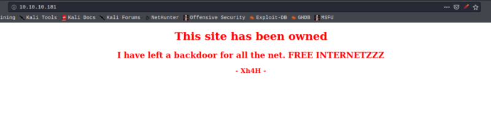  Xh4H is the creator of the machine. What does this mean?  I dig deeper into the source code and find some kind of hint commented there:  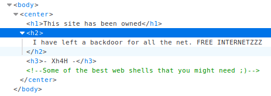  meanwhile the nmap scan came back discovered that ports 22 and 80 are open.  I follow the hint provided in the source code and discover a github page full of some of the best web shells. I guess that if he left a backdoor it is necessarily a webshell.   dirb is an amazing directory enumeration tool which I will use to find the shell.  I create a list that contains all the webshells names found on that github page. 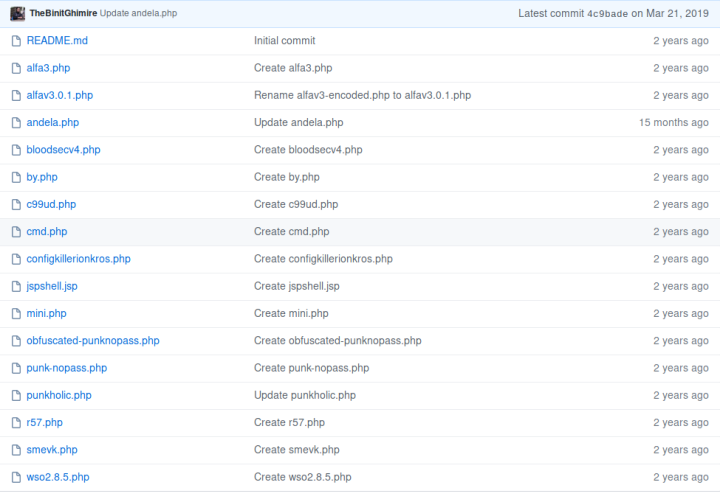  and save it to webshells on ~/. 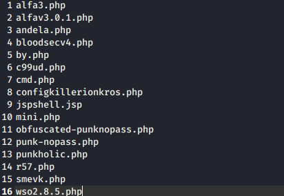  <small>dirb </small><a href="http://10.10.10.181">http://10.10.10.181</a><small> ~/webshells</small>  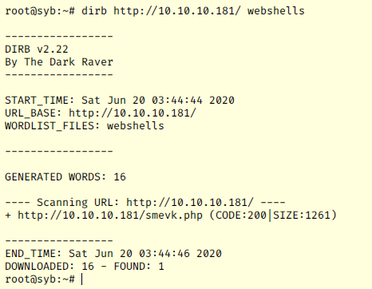  it found smevk.php!  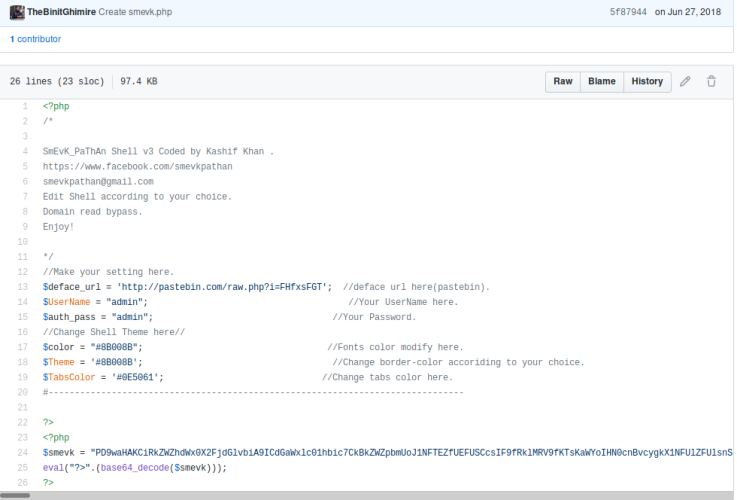  this is the backdoor and it seems like it has a decent web interface ;)  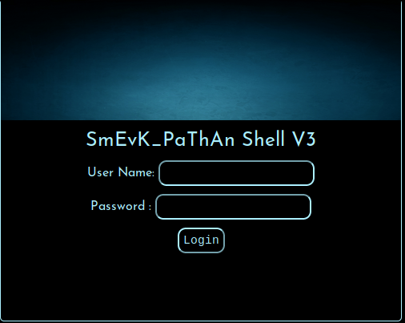  login creds are: admin / admin (as given in the shell description)  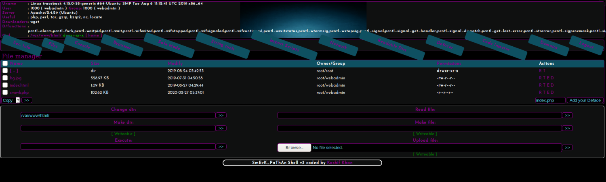  so now I am logged into this webshell as webadmin which is a normal user on the system.  Let's try to get a normal shell. Through this webshell I am able to traverse all folders and r/w whatever is permitted. Which is not much. After a little search, I find that the ssh server is installed under webadmin user, which I am logged into.   I go back to my kali and generate a key.  2 keys are generated, private one and a public one. In the .ssh folder, there's a file called authorized_keys. I rename my id_rsa.pub to authorized_keys and upload it while deleting the one that was originally stored on the victim's machine. this public key (my public key) is then used to decrypt the private key hosted in my kali machine, thus allowing authentication and a connection stream between the machines, since I am now an authorized host.   I now have a decent shell, but with webadmin as user.  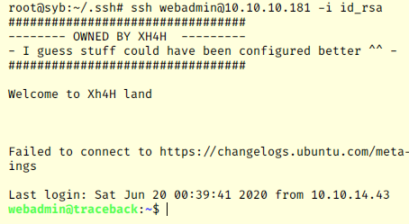  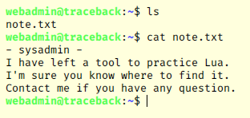  hmmm what's this? a tool to practice Lua?  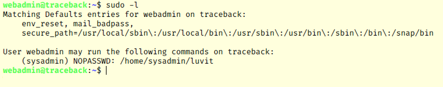  if Lua is installed maybe there's a way to get a shell with 'sysadmin' user just like with python's “import pty;pty.spawn('/bin/bash');”, since there is a NOPASSWD policy for that strange luvit file. 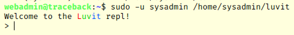   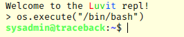 Level up - from webadmin to sysadmin.  When I logged into webadmin with ssh previously, I noticed a strange banner.    It is possible to edit the banner's content by accessing /etc/update-motd.d/ and changing the 00-header file.  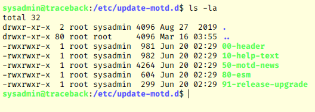  Here I see that the owner of the files is sysadmin, which allows me to modify the files.  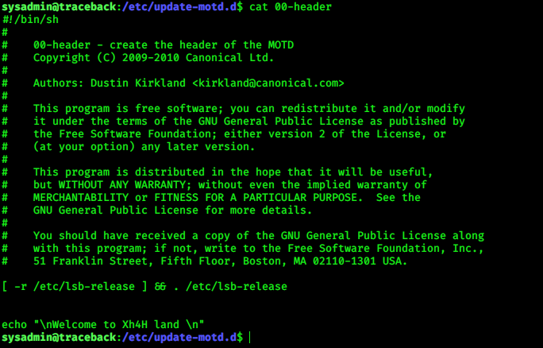 (switched to greenonblack since i was getting annoyed of my current bg)  that ‘echo’ line is the exact line from the banner. I'm gonna play with this... 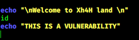  Here I am sending the “id” command which should print out the id values, and a simple echo just like the "weclome to xh4h land" string above.  Now what I need is to login again to see if any changes were made to the banner. 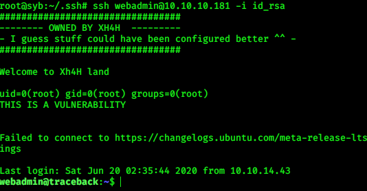  hmmm... The id comes out as root and the string is echoed successfully. I wonder if I can echo the root flag like this.  (00-header file) 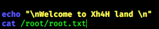  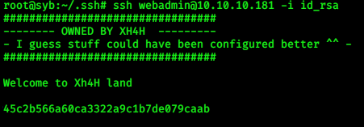  #rooted.  *user flag is in /home/sysadmin/</body></html>
